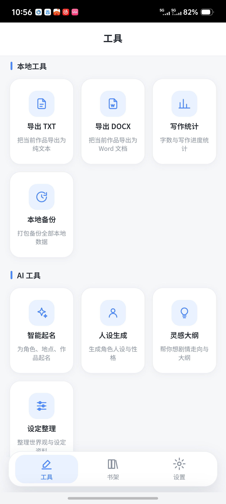
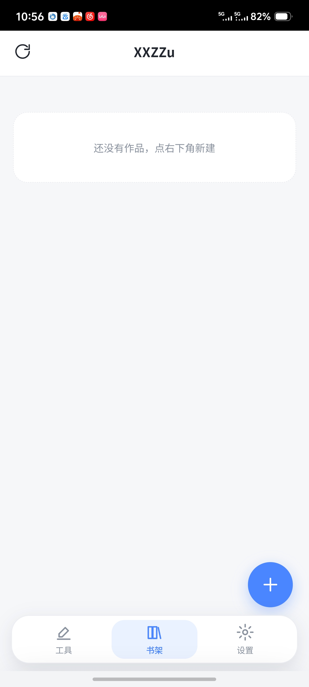
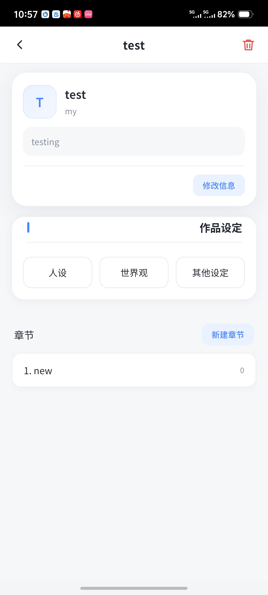
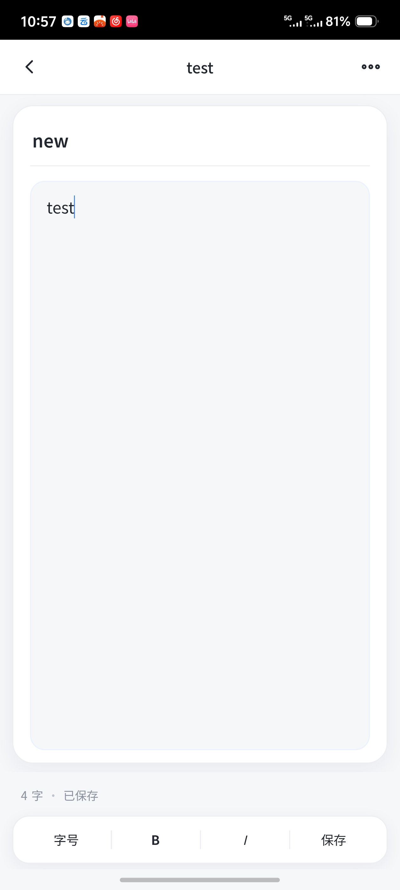

# A_XXZZu · 本地小说写作器

一个**纯本地、无登录、无云同步**的小说写作 App。
作品 → 章节两层结构，支持 txt / docx 导出，可选接入 DeepSeek 做 AI 辅助。

> 📱 Android 应用，基于 WebView 套壳（手搓打包，不依赖 Android Studio / Gradle）。

---

## ✨ 功能特性

| 功能 | 说明 |
|---|---|
| 📚 **作品 / 章节管理** | 两层结构，作品 → 章节，自由增删改 |
| 💾 **纯本地存储** | 数据存 `localStorage`，键前缀按账号隔离，**不上传任何服务器** |
| 📤 **导出** | 支持 `.txt` 和 `.docx` 两种格式导出 |
| 🤖 **AI 辅助（选填）** | 可选接入 DeepSeek API，不填也能正常用 |
| 🌗 **日夜皮肤** | 内置浅色 / 深色主题切换 |
| 🔒 **无登录 / 无云同步** | 打开即用，数据永远留在你自己手机上 |

---

---
## 🖼️ 界面预览

| 工具 | 书架 | 作品 | 编辑器 |
|---|---|---|---|
|  |  |  |  |

## 📁 项目结构

```
A_XXZZu/
├── index.html              # 主页面（WebView 入口）
├── style.css               # 样式（含日夜主题）
├── core.js                 # 核心逻辑（作品/章节/导出/AI）
├── lib/
│   └── marked.min.js       # Markdown 渲染库
├── android/
│   ├── AndroidManifest.xml # 应用清单
│   ├── src/                # Java 源码（MainActivity）
│   ├── res/                # 图标等资源
│   └── assets/             # 打包时同步的网页资源
├── icons/                  # 图标素材与生成脚本
├── build.sh                # 一键打包 APK
└── backup.sh               # 备份脚本
```

---

## 🔨 自行打包 APK

### 依赖

- `openjdk-21`（提供 `javac`、`keytool`）
- `aapt2`、`d8`（或 `dx` / `r8`）、`apksigner`
- `zipalign`、`zip`
- Android SDK 的 `android.jar`（脚本会自动探测常见路径）

### 打包

```bash
cd A_XXZZu
bash build.sh
```

产物：`XXZZu-signed.apk`

> 首次打包会自动生成 `debug.keystore` 用于签名。
> 如需自定义密钥密码，先 `export KS_PASS=你的密码`（默认 `123456`，**仅供本地调试**）。

---

## 🔐 关于隐私

- 所有写作数据**仅保存在设备本地**（`localStorage`），App **不联网上传**。
- 若启用 DeepSeek 辅助，请求会发往 DeepSeek 官方接口，密钥由你自行填写、仅存本地。
- 仓库中**不包含**任何签名密钥（`*.keystore` 已在 `.gitignore` 排除）。

---

## 📄 许可

本项目采用 **MIT License** 开源，详见 [LICENSE](LICENSE)。

个人项目，欢迎学习与自用。
